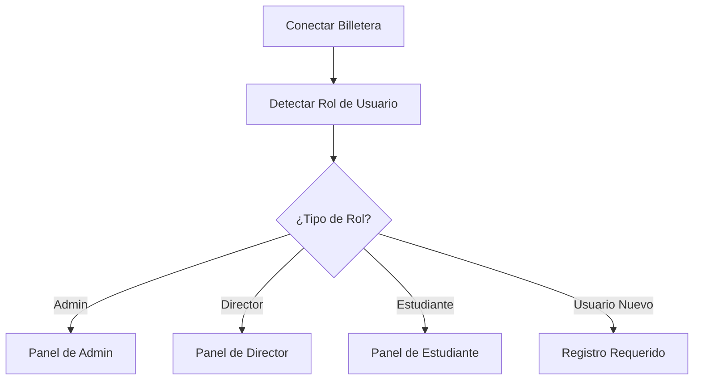

<div align="center">
  
  
  [](https://certifi-chain.vercel.app/)
  [](LICENSE)
  [](https://dorahacks.io/hackathon/defi-mini-hackathon/detail)
  
  # CertifyChain
  
  **Plataforma Descentralizada de Gestión de Certificados Académicos**
  
  🎓 **Transformando la educación a través de certificados NFT basados en blockchain**
  
  [🚀 Demo en Vivo](https://certifi-chain.vercel.app/) | [📹 Video Demo](#demo) | [📊 Presentación](#pitch)
</div>

---

## 🌟 Problemática

Los sistemas tradicionales de certificación académica enfrentan desafíos críticos:
- **Falsificación de Documentos**: Los certificados en papel pueden ser fácilmente falsificados
- **Demoras en Verificación**: Los procesos manuales de verificación toman semanas
- **Control Centralizado**: Puntos únicos de falla en sistemas institucionales
- **Accesibilidad Limitada**: Barreras geográficas para la verificación de credenciales
- **Altos Costos**: Procedimientos de verificación costosos para empleadores e instituciones

## 💡 Nuestra Solución

**CertifyChain** es una plataforma descentralizada revolucionaria que aprovecha la tecnología blockchain para emitir, gestionar y verificar certificados académicos como NFTs (tokens ERC-721). Nuestra solución proporciona:

✅ **Registros Inmutables**: Certificados almacenados permanentemente en blockchain  
✅ **Verificación Instantánea**: Verificaciones de autenticidad en tiempo real  
✅ **Accesibilidad Global**: Verificación de credenciales sin fronteras  
✅ **Costo Efectivo**: Reducción del 90% en costos de verificación  
✅ **A Prueba de Manipulación**: Documentos asegurados criptográficamente  

---

## 🚀 Características Principales

### 🔐 **Control de Acceso Basado en Roles**
- **Admin**: Propietario del contrato con control total del sistema
- **Director**: Emisores de certificados autorizados
- **Estudiante**: Receptores y propietarios de certificados

### 🎯 **Gestión del Ciclo de Vida de Certificados**
1. **Emisión**: Los directores crean certificados con plantillas personalizadas
2. **Almacenamiento**: Metadatos e imágenes almacenados en IPFS vía Pinata
3. **Acuñación**: Certificados acuñados como NFTs ERC-721
4. **Verificación**: Verificaciones instantáneas de autenticidad basadas en blockchain
5. **Propiedad**: Los estudiantes pueden importar NFTs a sus billeteras

### 🔄 **Integración Perfecta**
- Soporte para MetaMask y WalletConnect
- Compatibilidad multi-cadena (ecosistema Ethereum)
- Almacenamiento descentralizado IPFS
- Generación de códigos QR para verificación rápida

---

## 🛠 Stack Tecnológico

### **Frontend**
- ⚛️ **React 19** - Framework de UI moderno
- 🏃‍♂️ **Vite** - Herramienta de construcción ultrarrápida
- 📝 **TypeScript** - Desarrollo con tipos seguros
- 🎨 **TailwindCSS** - Estilos utility-first
- 🌈 **Wagmi** - Hooks de React para Web3

### **Blockchain**
- 🔗 **Ethereum** - Redes compatibles con EVM
- 📜 **Solidity** - Desarrollo de contratos inteligentes
- 🎫 **ERC-721** - Estándar NFT para certificados
- 🔑 **OpenZeppelin** - Contratos auditados en seguridad

### **Almacenamiento e Infraestructura**
- 🌐 **IPFS** - Almacenamiento de archivos descentralizado
- 📌 **Pinata** - Servicio de anclaje IPFS
- ☁️ **Vercel** - Plataforma de despliegue
- 🦊 **MetaMask** - Integración de billetera

### **Contratos Inteligentes**
- **CertifyRoles**: `0xDaC5fd597801Fe86422fE64D714F9F6452424927`
- **CertiChainToken**: `0x86Ae08076DBD7c1227cBD3d8743062C3bBB91F54`

---

## 🏗 Arquitectura del Proyecto

```
Frontend-certify-CHAIN/
├── 📁 public/                   # Activos estáticos
├── 📁 src/
│   ├── 📁 assets/              # Imágenes y recursos
│   ├── 📁 chains/              # Configuraciones blockchain
│   ├── 📁 components/          # Componentes React
│   │   ├── 👑 AdminPanel.tsx   # Gestión de roles admin
│   │   ├── 🎓 DirectorPanel.tsx # Emisión de certificados
│   │   ├── 👨‍🎓 StudentPanel.tsx  # Visualización de certificados
│   │   ├── 🎯 RoleSelector.tsx  # Detección de roles
│   │   └── ✨ AnimatedBackground.tsx
│   ├── 📁 contracts/           # Interfaces de contratos inteligentes
│   │   ├── 📄 CertifyRoles.ts
│   │   ├── 📄 CertiChainToken.ts
│   │   └── 📄 getContract.ts
│   ├── 📄 App.tsx              # Aplicación principal
│   └── 📄 main.tsx             # Punto de entrada
├── 📋 package.json             # Dependencias
└── ⚙️ vite.config.ts          # Configuración de construcción
```

---

## ⚙️ Cómo Funciona

### 1. **Autenticación de Usuario**


### 2. **Flujo de Emisión de Certificados**
1. **Director** crea certificado usando plantilla
2. Imagen del certificado generada y subida a **IPFS**
3. Metadatos (JSON) creados y almacenados en **IPFS**
4. Director paga tarifa de acuñación de `0.0001 ETH`
5. Función `safeMint` llamada en contrato ERC-721
6. **Certificado NFT** acuñado a la dirección del estudiante
7. **Hash de transacción** generado para verificación

### 3. **Proceso de Verificación**
- Los estudiantes ven certificados en su dashboard
- Los códigos QR proporcionan enlaces de verificación instantánea
- Los certificados pueden verificarse en Etherscan
- Los NFTs pueden importarse a cualquier billetera compatible

---

## 🚀 Inicio Rápido

### Prerrequisitos
- Node.js 18+ y npm
- MetaMask o billetera Web3 compatible
- Git

### Instalación

```bash
# Clonar el repositorio
git clone https://github.com/certify-CHAIN/Frontend-certify-CHAIN.git
cd Frontend-certify-CHAIN

# Instalar dependencias
npm install

# Iniciar servidor de desarrollo
npm run dev
```

### Configuración del Entorno
Crear archivo `.env.local`:
```env
VITE_PINATA_JWT=tu_token_jwt_pinata
VITE_PINATA_GATEWAY=tu_url_gateway_pinata
```

### Construcción para Producción
```bash
# Construir la aplicación
npm run build

# Previsualizar construcción de producción
npm run preview
```

---

## 🎮 Guía de Uso

### Para Administradores
1. Conectar billetera como propietario del contrato
2. Navegar al Panel de Admin
3. Asignar roles de Director y Estudiante
4. Monitorear actividad del sistema

### Para Directores
1. Conectar billetera con rol de Director
2. Acceder al Panel de Emisión de Certificados
3. Crear certificado usando plantilla
4. Llenar detalles del estudiante y metadatos
5. Pagar tarifa de acuñación y confirmar transacción
6. Compartir certificado con estudiante

### Para Estudiantes
1. Conectar billetera para ver certificados
2. Explorar certificados emitidos
3. Descargar imágenes de certificados
4. Verificar autenticidad en blockchain
5. Importar NFTs a billetera

---

## 🔒 Seguridad y Confianza

### **Seguridad Blockchain**
- Registros de certificados inmutables
- Prueba criptográfica de autenticidad
- Sistema de verificación descentralizado
- Sin punto único de falla

### **Seguridad de Contratos Inteligentes**
- Control de acceso basado en roles
- Funciones administrativas solo para propietario
- Mecanismos de acuñación seguros
- Operaciones optimizadas en gas

### **Integridad de Datos**
- Direccionamiento de contenido IPFS
- Metadatos a prueba de manipulación
- Garantía de almacenamiento permanente
- Sistema de archivos distribuido

---

## 🎯 Submisión del Hackathon

### **Somnia DeFi Mini Hackathon**
- 🗓 **Fecha de Submisión**: 17 de septiembre, 2025
- 🔗 **Repositorio**: Público con >2 commits
- 📝 **Documentación**: README comprensivo
- 🎥 **Demo**: Despliegue de aplicación en vivo

### **Puntos Destacados de Innovación**
- **Integración DeFi**: Los certificados tokenizados habilitan nuevos modelos económicos
- **Compatibilidad Cross-Chain**: Capacidad de despliegue multi-red
- **Impacto Educativo**: Revolucionando la verificación de credenciales
- **Escalabilidad**: Contratos inteligentes eficientes en gas para adopción masiva

---

## 🌐 Demo y Enlaces

- 🚀 **Aplicación en Vivo**: [CertifyChain DApp](https://certifi-chain.vercel.app/)
- 📹 **Video Demo**: [Ver Video Demo](#)
- 📊 **Presentación**: [Ver Presentación](#)
- 🔍 **Contratos Inteligentes**: [Ver en Etherscan](https://etherscan.io/)

---

## 🛣 Hoja de Ruta

### **Fase 1: Plataforma Núcleo** ✅
- Emisión básica de certificados
- Sistema de gestión de roles
- Integración IPFS

### **Fase 2: Características Mejoradas** 🚧
- Procesamiento por lotes de certificados
- Plantillas avanzadas
- Despliegue multi-cadena

### **Fase 3: Crecimiento del Ecosistema** 📋
- Asociaciones institucionales
- API para integración de terceros
- Aplicación móvil

### **Fase 4: Integración DeFi** 🎯
- Préstamos respaldados por certificados
- Sistema de puntuación de reputación
- Lanzamiento de token de gobernanza

---

## 🤝 Contribuir

¡Damos la bienvenida a contribuciones a CertifyChain! Por favor lee nuestras pautas de contribución y envía pull requests para cualquier mejora.

### **Configuración de Desarrollo**
1. Fork del repositorio
2. Crear rama de característica (`git checkout -b feature/caracteristica-increible`)
3. Commit de cambios (`git commit -m 'Agregar característica increíble'`)
4. Push a la rama (`git push origin feature/caracteristica-increible`)
5. Abrir Pull Request

---

## 📄 Licencia

Este proyecto está licenciado bajo la Licencia MIT - ver el archivo [LICENSE](LICENSE) para detalles.

---

## 👥 Equipo

**Equipo de Desarrollo CertifyChain**
- 🧑‍💻 **Desarrollador Principal**: Desarrollo Blockchain y Frontend
- 🎨 **Diseñador UI/UX**: Diseño de Experiencia de Usuario
- 🔐 **Auditor de Contratos Inteligentes**: Seguridad y Optimización

---

## 📞 Contacto

- 📧 **Email**: team@certifychain.io
- 🐦 **Twitter**: [@CertifyChain](#)
- 💬 **Discord**: [Únete a nuestra comunidad](#)
- 🌐 **Sitio Web**: [www.certifychain.io](#)

---

<div align="center">
  
**Construido con ❤️ para el Somnia DeFi Mini Hackathon**

*Revolucionando la educación a través de la tecnología blockchain*

</div>