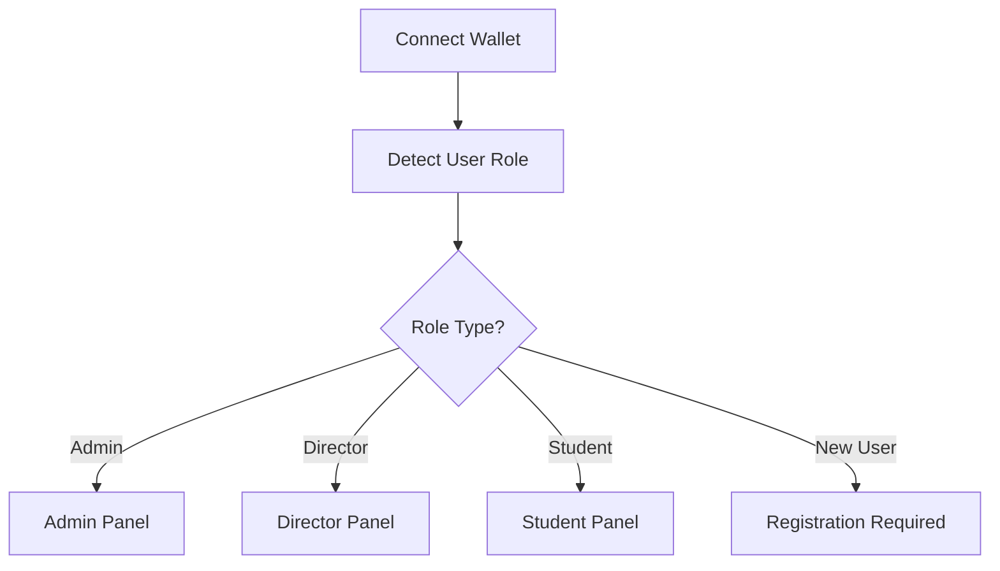

<div align="center">
  
  
  [](https://certifi-chain.vercel.app/)
  [](LICENSE)
  [](https://dorahacks.io/hackathon/defi-mini-hackathon/detail)
  
  # CertifyChain
  
  **Decentralized Academic Certificate Management Platform**
  
  🎓 **Transforming education through blockchain-powered NFT certificates**
  
  [🚀 Live Demo](https://certifi-chain.vercel.app/) | [📹 Video Demo](#demo) | [📊 Pitch Deck](#pitch)
</div>

---

## 🌟 Problem Statement

Traditional academic certification systems face critical challenges:
- **Document Forgery**: Paper certificates can be easily falsified
- **Verification Delays**: Manual verification processes take weeks
- **Centralized Control**: Single points of failure in institutional systems
- **Limited Accessibility**: Geographic barriers to credential verification
- **High Costs**: Expensive verification procedures for employers and institutions

## 💡 Our Solution

**CertifyChain** is a revolutionary decentralized platform that leverages blockchain technology to issue, manage, and verify academic certificates as NFTs (ERC-721 tokens). Our solution provides:

✅ **Immutable Records**: Certificates stored permanently on blockchain  
✅ **Instant Verification**: Real-time authenticity checks  
✅ **Global Accessibility**: Borderless credential verification  
✅ **Cost Effective**: Reduced verification costs by 90%  
✅ **Tamper Proof**: Cryptographically secured documents  

---

## 🚀 Key Features

### 🔐 **Role-Based Access Control**
- **Admin**: Contract owner with full system control
- **Director**: Authorized certificate issuers
- **Student**: Certificate recipients and owners

### 🎯 **Certificate Lifecycle Management**
1. **Issuance**: Directors create certificates with custom templates
2. **Storage**: Metadata and images stored on IPFS via Pinata
3. **Minting**: Certificates minted as ERC-721 NFTs
4. **Verification**: Instant blockchain-based authenticity checks
5. **Ownership**: Students can import NFTs to their wallets

### 🔄 **Seamless Integration**
- MetaMask and WalletConnect support
- Multi-chain compatibility (Ethereum ecosystem)
- IPFS decentralized storage
- QR code generation for quick verification

---

## 🛠 Technology Stack

### **Frontend**
- ⚛️ **React 19** - Modern UI framework
- 🏃‍♂️ **Vite** - Lightning-fast build tool
- 📝 **TypeScript** - Type-safe development
- 🎨 **TailwindCSS** - Utility-first styling
- 🌈 **Wagmi** - Web3 React hooks

### **Blockchain**
- 🔗 **Ethereum** - EVM-compatible networks
- 📜 **Solidity** - Smart contract development
- 🎫 **ERC-721** - NFT standard for certificates
- 🔑 **OpenZeppelin** - Security-audited contracts

### **Storage & Infrastructure**
- 🌐 **IPFS** - Decentralized file storage
- 📌 **Pinata** - IPFS pinning service
- ☁️ **Vercel** - Deployment platform
- 🦊 **MetaMask** - Wallet integration

### **Smart Contracts**
- **CertifyRoles**: `0xDaC5fd597801Fe86422fE64D714F9F6452424927`
- **CertiChainToken**: `0x86Ae08076DBD7c1227cBD3d8743062C3bBB91F54`

---

## 🏗 Project Architecture

```
Frontend-certify-CHAIN/
├── 📁 public/                   # Static assets
├── 📁 src/
│   ├── 📁 assets/              # Images and resources
│   ├── 📁 chains/              # Blockchain configurations
│   ├── 📁 components/          # React components
│   │   ├── 👑 AdminPanel.tsx   # Admin role management
│   │   ├── 🎓 DirectorPanel.tsx # Certificate issuance
│   │   ├── 👨‍🎓 StudentPanel.tsx  # Certificate viewing
│   │   ├── 🎯 RoleSelector.tsx  # Role detection
│   │   └── ✨ AnimatedBackground.tsx
│   ├── 📁 contracts/           # Smart contract interfaces
│   │   ├── 📄 CertifyRoles.ts
│   │   ├── 📄 CertiChainToken.ts
│   │   └── 📄 getContract.ts
│   ├── 📄 App.tsx              # Main application
│   └── 📄 main.tsx             # Entry point
├── 📋 package.json             # Dependencies
└── ⚙️ vite.config.ts          # Build configuration
```

---

## ⚙️ How It Works

### 1. **User Authentication**


### 2. **Certificate Issuance Flow**
1. **Director** creates certificate using template
2. Certificate image generated and uploaded to **IPFS**
3. Metadata (JSON) created and stored on **IPFS**
4. Director pays `0.0001 ETH` minting fee
5. `safeMint` function called on ERC-721 contract
6. **NFT certificate** minted to student's address
7. **Transaction hash** generated for verification

### 3. **Verification Process**
- Students view certificates in their dashboard
- QR codes provide instant verification links
- Certificates can be verified on Etherscan
- NFTs can be imported to any compatible wallet

---

## 🚀 Quick Start

### Prerequisites
- Node.js 18+ and npm
- MetaMask or compatible Web3 wallet
- Git

### Installation

```bash
# Clone the repository
git clone https://github.com/certify-CHAIN/Frontend-certify-CHAIN.git
cd Frontend-certify-CHAIN

# Install dependencies
npm install

# Start development server
npm run dev
```

### Environment Setup
Create a `.env.local` file:
```env
VITE_PINATA_JWT=your_pinata_jwt_token
VITE_PINATA_GATEWAY=your_pinata_gateway_url
```

### Build for Production
```bash
# Build the application
npm run build

# Preview production build
npm run preview
```

---

## 🎮 Usage Guide

### For Administrators
1. Connect wallet as contract owner
2. Navigate to Admin Panel
3. Assign Director and Student roles
4. Monitor system activity

### For Directors
1. Connect wallet with Director role
2. Access Certificate Issuance Panel
3. Create certificate using template
4. Fill in student details and metadata
5. Pay minting fee and confirm transaction
6. Share certificate with student

### For Students
1. Connect wallet to view certificates
2. Browse issued certificates
3. Download certificate images
4. Verify authenticity on blockchain
5. Import NFTs to wallet

---

## 🔒 Security & Trust

### **Blockchain Security**
- Immutable certificate records
- Cryptographic proof of authenticity
- Decentralized verification system
- No single point of failure

### **Smart Contract Security**
- Role-based access control
- Owner-only administrative functions
- Secure minting mechanisms
- Gas-optimized operations

### **Data Integrity**
- IPFS content addressing
- Tamper-proof metadata
- Permanent storage guarantee
- Distributed file system

---

## 🎯 Hackathon Submission

### **Somnia DeFi Mini Hackathon**
- 🗓 **Submission Date**: September 17, 2025
- 🔗 **Repository**: Public with >2 commits
- 📝 **Documentation**: Comprehensive README
- 🎥 **Demo**: Live application deployment

### **Innovation Highlights**
- **DeFi Integration**: Tokenized certificates enable new economic models
- **Cross-Chain Compatibility**: Multi-network deployment capability
- **Educational Impact**: Revolutionizing credential verification
- **Scalability**: Gas-efficient smart contracts for mass adoption

---

## 🌐 Demo & Links

- 🚀 **Live Application**: [CertifyChain DApp](https://certifi-chain.vercel.app/)
- 📹 **Video Demo**: [Watch Demo Video](#)
- 📊 **Pitch Deck**: [View Presentation](#)
- 🔍 **Smart Contracts**: [View on Etherscan](https://etherscan.io/)

---

## 🛣 Roadmap

### **Phase 1: Core Platform** ✅
- Basic certificate issuance
- Role management system
- IPFS integration

### **Phase 2: Enhanced Features** 🚧
- Batch certificate processing
- Advanced templates
- Multi-chain deployment

### **Phase 3: Ecosystem Growth** 📋
- Institution partnerships
- API for third-party integration
- Mobile application

### **Phase 4: DeFi Integration** 🎯
- Certificate-backed lending
- Reputation scoring system
- Governance token launch

---

## 🤝 Contributing

We welcome contributions to CertifyChain! Please read our contributing guidelines and submit pull requests for any improvements.

### **Development Setup**
1. Fork the repository
2. Create feature branch (`git checkout -b feature/amazing-feature`)
3. Commit changes (`git commit -m 'Add amazing feature'`)
4. Push to branch (`git push origin feature/amazing-feature`)
5. Open Pull Request

---

## 📄 License

This project is licensed under the MIT License - see the [LICENSE](LICENSE) file for details.

---

## 👥 Team

**CertifyChain Development Team**
- 🧑‍💻 **Lead Developer**: Blockchain & Frontend Development
- 🎨 **UI/UX Designer**: User Experience Design
- 🔐 **Smart Contract Auditor**: Security & Optimization

---

## 📞 Contact

- 📧 **Email**: team@certifychain.io
- 🐦 **Twitter**: [@CertifyChain](#)
- 💬 **Discord**: [Join our community](#)
- 🌐 **Website**: [www.certifychain.io](#)

---

<div align="center">
  
**Built with ❤️ for the Somnia DeFi Mini Hackathon**

*Revolutionizing education through blockchain technology*

</div>  