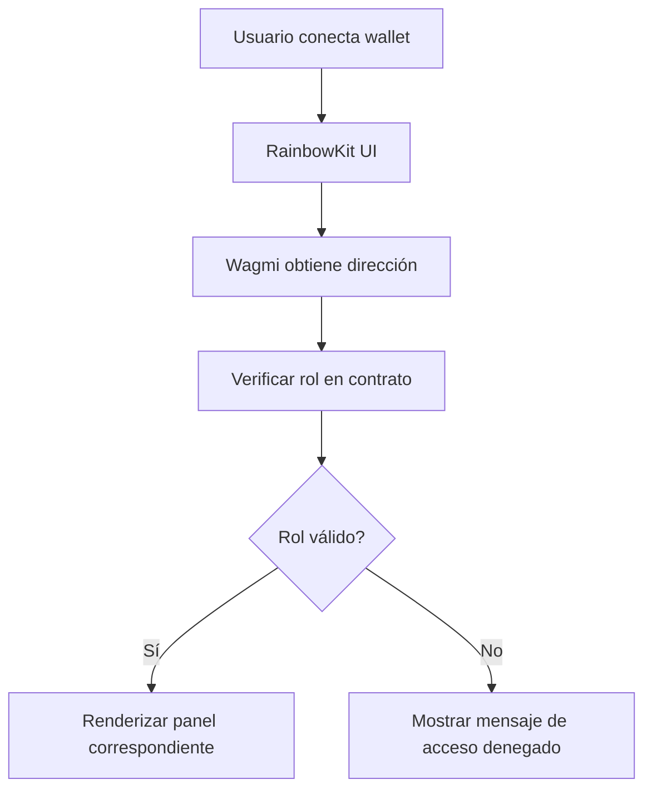
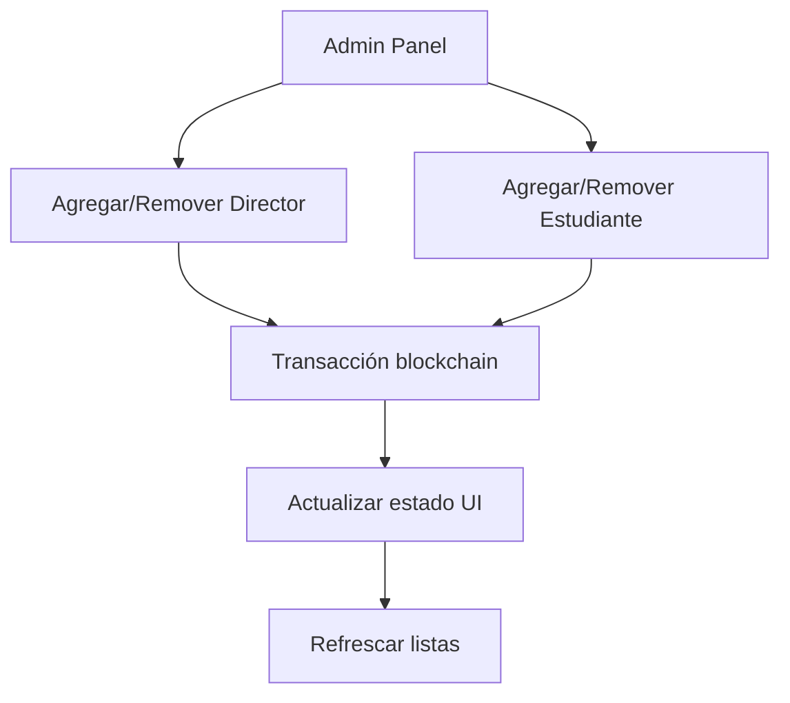
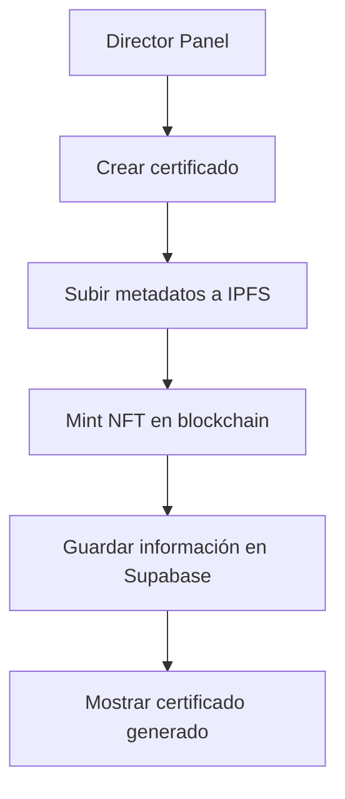

# 🏗️ Arquitectura del Sistema - Certifi-CHAIN

## 📖 Descripción General

Certifi-CHAIN es una **DApp (Aplicación Descentralizada)** para la gestión y emisión de certificados NFT utilizando tecnología blockchain. El sistema implementa un control de acceso basado en roles (RBAC) y almacenamiento descentralizado.

## 🎯 Diagrama de Arquitectura

```
┌─────────────────────────────────────────────────────────────────┐
│                        FRONTEND (React + Vite)                  │
├─────────────────────────────────────────────────────────────────┤
│  ┌─────────────────┐  ┌─────────────────┐  ┌─────────────────┐  │
│  │   main.tsx      │  │     App.tsx     │  │ CertificatePage │  │
│  │  (Entry Point)  │  │  (Main Logic)   │  │   (NFT View)    │  │
│  └─────────────────┘  └─────────────────┘  └─────────────────┘  │
│                                │                                 │
│  ┌─────────────────────────────┼─────────────────────────────┐   │
│  │              COMPONENTS                                   │   │
│  │  ┌─────────────┐ ┌─────────────┐ ┌─────────────────────┐ │   │
│  │  │ AdminPanel  │ │DirectorPanel│ │   StudentPanel      │ │   │
│  │  │   (CRUD)    │ │ (Certificates)│ │  (View Certs)     │ │   │
│  │  └─────────────┘ └─────────────┘ └─────────────────────┘ │   │
│  │  ┌─────────────┐ ┌─────────────┐                        │   │
│  │  │RoleSelector │ │AnimatedBG   │                        │   │
│  │  └─────────────┘ └─────────────┘                        │   │
│  └─────────────────────────────────────────────────────────┘   │
└─────────────────────────────────────────────────────────────────┘
                                │
                                ▼
┌─────────────────────────────────────────────────────────────────┐
│                    WALLET CONNECTION LAYER                      │
├─────────────────────────────────────────────────────────────────┤
│  ┌─────────────────┐  ┌─────────────────┐  ┌─────────────────┐  │
│  │  RainbowKit     │  │     Wagmi       │  │  TanStack Query │  │
│  │  (UI Wallet)    │  │ (Blockchain API)│  │   (Caching)     │  │
│  └─────────────────┘  └─────────────────┘  └─────────────────┘  │
└─────────────────────────────────────────────────────────────────┘
                                │
                                ▼
┌─────────────────────────────────────────────────────────────────┐
│                      BLOCKCHAIN LAYER                          │
├─────────────────────────────────────────────────────────────────┤
│  ┌─────────────────┐  ┌─────────────────┐  ┌─────────────────┐  │
│  │  Smart Contracts│  │   Somnia Chain  │  │     Ethers.js   │  │
│  │  (CertifyRoles) │  │   (Testnet)     │  │   (Interaction) │  │
│  └─────────────────┘  └─────────────────┘  └─────────────────┘  │
└─────────────────────────────────────────────────────────────────┘
                                │
                                ▼
┌─────────────────────────────────────────────────────────────────┐
│                     EXTERNAL SERVICES                          │
├─────────────────────────────────────────────────────────────────┤
│  ┌─────────────────┐  ┌─────────────────┐  ┌─────────────────┐  │
│  │     Pinata      │  │    Supabase     │  │   CodeGPT       │  │
│  │   (IPFS/NFT)    │  │   (Database)    │  │   (Widget)      │  │
│  └─────────────────┘  └─────────────────┘  └─────────────────┘  │
└─────────────────────────────────────────────────────────────────┘
```

## 🧩 Componentes del Sistema

### 1. 🎨 **Frontend Layer**
| Componente | Tecnología | Propósito |
|------------|------------|-----------|
| **Framework** | React 19 + TypeScript | Interfaz de usuario interactiva |
| **Bundler** | Vite | Desarrollo y construcción rápida |
| **Styling** | TailwindCSS | Diseño responsivo y moderno |
| **Routing** | React Router DOM | Navegación entre páginas |
| **State Management** | React Hooks | Gestión de estado local |

#### Estructura de Componentes:
```
src/
├── components/
│   ├── AdminPanel.tsx      # Panel administrativo (CRUD)
│   ├── DirectorPanel.tsx   # Panel de directores
│   ├── StudentPanel.tsx    # Panel de estudiantes
│   ├── RoleSelector.tsx    # Selector de roles
│   └── AnimatedBackground.tsx # Fondo animado
├── App.tsx                 # Componente principal
├── main.tsx               # Punto de entrada
└── CertificatePage.tsx    # Vista de certificados
```

### 2. 🔗 **Wallet & Blockchain Integration**
| Librería | Función |
|----------|---------|
| **RainbowKit** | Interfaz de conexión de wallets |
| **Wagmi** | Hooks de React para Ethereum |
| **Viem** | Cliente TypeScript para Ethereum |
| **Ethers.js** | Interacción con contratos inteligentes |
| **TanStack Query** | Caché y sincronización de datos |

### 3. ⚡ **Blockchain Layer**
| Componente | Detalles |
|------------|----------|
| **Red** | Somnia Shannon Testnet |
| **RPC** | `https://dream-rpc.somnia.network` |
| **Explorer** | `https://shannon-explorer.somnia.network` |
| **Contrato** | CertifyRoles - `0x786E41e7a24C8B9031b91749F8f1A649457CC1BF` |

#### Smart Contract Functions:
- `addDirector(address)` - Agregar director
- `removeDirector(address)` - Remover director
- `addStudent(address)` - Agregar estudiante
- `removeStudent(address)` - Remover estudiante
- `checkRole(address)` - Verificar rol del usuario
- `getAllDirectors()` - Obtener lista de directores
- `getAllStudents()` - Obtener lista de estudiantes

### 4. 🌐 **External Services**
| Servicio | Propósito | Integración |
|----------|-----------|-------------|
| **Pinata** | Almacenamiento IPFS para metadatos NFT | API REST |
| **Supabase** | Base de datos para información adicional | JavaScript SDK |
| **CodeGPT** | Widget de soporte AI | Script embebido |

## 🔄 Flujo de Datos

### 1. **Autenticación y Autorización**


### 2. **Gestión de Roles (Admin)**


### 3. **Emisión de Certificados (Director)**


## 🎯 Patrones Arquitectónicos

### **1. Component-Based Architecture**
- Componentes reutilizables y modulares
- Separación clara de responsabilidades
- Estado local y global bien definido

### **2. Role-Based Access Control (RBAC)**
```
Admin → Full CRUD operations (directores, estudiantes)
Director → Certificate management (crear, editar)
Student → View certificates (solo lectura)
```

### **3. Decentralized Storage**
- **Blockchain**: Registro inmutable de certificados
- **IPFS**: Almacenamiento de metadatos y archivos
- **Database**: Datos auxiliares y caché

### **4. Reactive UI Pattern**
- Estado reactivo con React Hooks
- Actualizaciones automáticas en tiempo real
- Manejo optimista de transacciones

## 🛠️ Configuración del Desarrollo

### **Scripts Disponibles**
```bash
npm run dev      # Servidor de desarrollo
npm run build    # Construcción para producción
npm run lint     # Análisis de código
npm run preview  # Vista previa de producción
```

### **Estructura del Proyecto**
```
certifi-CHAIN/
├── public/                 # Recursos públicos
├── src/
│   ├── assets/            # Imágenes y recursos
│   ├── chains/            # Configuración de blockchain
│   ├── components/        # Componentes React
│   ├── contracts/         # ABIs y contratos
│   ├── App.tsx           # Componente principal
│   ├── main.tsx          # Punto de entrada
│   └── index.css         # Estilos globales
├── package.json          # Dependencias
├── vite.config.ts        # Configuración Vite
├── tailwind.config.js    # Configuración Tailwind
└── tsconfig.json         # Configuración TypeScript
```

## 🔒 Seguridad

### **Medidas Implementadas**
- ✅ Verificación de roles en smart contract
- ✅ Validación de entrada en frontend
- ✅ Manejo seguro de claves privadas (wallet del usuario)
- ✅ Transacciones firmadas localmente
- ✅ Validación de transacciones en blockchain

### **Consideraciones de Seguridad**
- Los usuarios mantienen control total de sus claves privadas
- El contrato inteligente es inmutable una vez deployado
- Los metadatos en IPFS son permanentes e inmutables
- Autenticación basada en firma criptográfica

## 🚀 Ventajas de la Arquitectura

1. **Descentralización**: Sin punto único de falla
2. **Transparencia**: Todas las transacciones son públicas
3. **Inmutabilidad**: Los certificados no pueden ser falsificados
4. **Escalabilidad**: Somnia ofrece alta velocidad y bajo costo
5. **Interoperabilidad**: Compatible con ecosistema Ethereum
6. **Experiencia de Usuario**: Interfaz moderna y responsiva

## 📈 Escalabilidad Futura

### **Posibles Mejoras**
- [ ] Migración a Mainnet
- [ ] Integración con más chains (Polygon, Arbitrum)
- [ ] Sistema de notificaciones
- [ ] API REST para integraciones externas
- [ ] Dashboard de analytics
- [ ] Firma digital de certificados
- [ ] Sistema de verificación QR

---

> **Nota**: Esta arquitectura está diseñada para ser modular, escalable y mantenible, siguiendo las mejores prácticas de desarrollo Web3 y React.